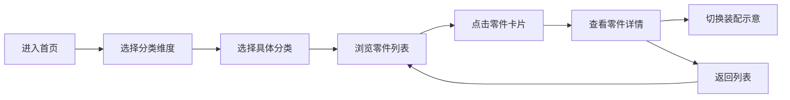

## 1. 产品概述

滕州墨家文化展览馆交互式零件图鉴系统，为参观者提供便捷的线上浏览体验，解决纸质图鉴查阅不便的问题。支持多维度分类浏览、零件详情展示，数据层与展示层分离，便于非技术人员维护。

- **目标用户**：展览馆参观者（平板端为主）、手机扫码访问用户、展览馆工作人员（数据维护）
- **核心价值**：提升参观体验，降低讲解成本，便于数据更新维护

## 2. 核心功能

### 2.1 用户角色

| 角色 | 使用方式 | 核心权限 |
|------|----------|----------|
| 参观者 | 平板/手机浏览器访问 | 浏览零件图鉴、切换分类、查看详情 |
| 工作人员 | 修改 JSON 配置文件 | 添加、编辑、删除零件数据 |

### 2.2 功能模块

1. **分类浏览页**：三维度分类切换（功用/材质/出土地点）、零件网格展示、搜索过滤
2. **零件详情页**：线稿图展示、尺寸标注、装配位置示意（三种典型机关）、基本信息
3. **导航系统**：顶部导航栏、分类面包屑、返回按钮

### 2.3 页面详情

| 页面名称 | 模块名称 | 功能描述 |
|----------|----------|----------|
| 分类浏览页 | 维度切换标签 | 功用/材质/出土地点三种分类维度切换，带动画过渡 |
| 分类浏览页 | 分类侧边栏 | 展示当前维度下的所有分类项，点击筛选零件 |
| 分类浏览页 | 零件网格 | 卡片式展示零件缩略图和名称，悬停有交互效果 |
| 零件详情页 | 线稿图区域 | 大尺寸线稿图展示，支持缩放查看 |
| 零件详情页 | 尺寸标注 | 零件尺寸数据展示，配合图示标注 |
| 零件详情页 | 装配位置 | 三种典型机关中的装配位置示意，可切换查看 |
| 零件详情页 | 基本信息 | 零件名称、编号、材质、功用、出土地点等信息 |

## 3. 核心流程

参观者进入首页 → 选择分类维度 → 选择具体分类 → 浏览零件列表 → 点击零件卡片 → 查看零件详情 → 返回列表继续浏览

## 4. 用户界面设计

### 4.1 设计风格

- **主色调**：深褐色（#5C4033）、土黄色（#C4A35A）、赭石色（#8B4513）
- **辅助色**：青铜绿（#4A7C59）、米白色（#F5F0E8）
- **按钮风格**：圆角矩形，古朴纹理边框，悬停时轻微上浮
- **字体**：标题使用衬线字体（SimSun/宋体），正文使用思源黑体/微软雅黑
- **布局风格**：卡片式布局，仿古卷轴/竹简元素装饰
- **图标风格**：线性图标，古朴风格

### 4.2 页面设计概述

| 页面名称 | 模块名称 | UI 元素 |
|----------|----------|---------|
| 分类浏览页 | 顶部导航 | 馆名标题、维度切换标签、搜索框 |
| 分类浏览页 | 侧边栏 | 分类列表、选中状态高亮、数量角标 |
| 分类浏览页 | 零件网格 | 卡片缩略图、零件名称、编号标签 |
| 零件详情页 | 主图区 | 大幅线稿图、缩放控制、尺寸标注 |
| 零件详情页 | 信息区 | 零件属性表格、描述文字 |
| 零件详情页 | 装配示意 | 机关示意图、标注点、切换标签 |

### 4.3 响应式设计

- **桌面优先**：以 10 寸横屏平板（1280×800）为主要设计尺寸
- **平板横屏**：侧边栏 + 主内容区双栏布局
- **平板竖屏/手机**：单栏布局，分类切换改为顶部标签式
- **触控优化**：按钮和卡片尺寸适配触控操作，最小点击区域 44px

### 4.4 交互动效

- 分类维度切换：淡入淡出 + 滑动过渡
- 零件卡片：悬停放大 + 阴影加深
- 详情页进入：从卡片位置缩放过渡
- 装配示意切换：横向滑动切换
- 页面滚动：平滑滚动效果
