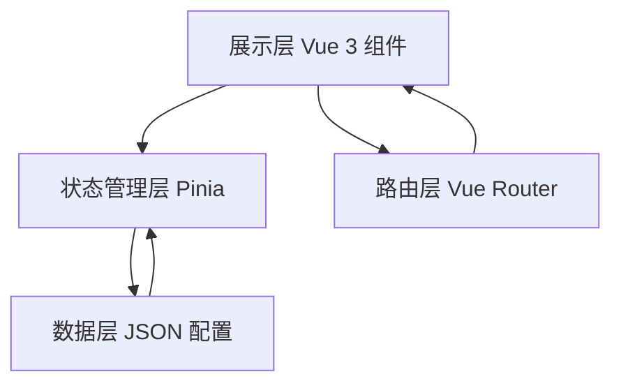

## 1. 架构设计



- **展示层**：Vue 3 组件，负责 UI 渲染和用户交互
- **状态管理层**：Pinia，管理分类筛选状态和零件详情状态
- **路由层**：Vue Router，处理页面导航和参数传递
- **数据层**：JSON 配置文件，存放所有零件数据，数据与展示完全分离

## 2. 技术描述

- **前端框架**：Vue 3 + TypeScript + Composition API
- **构建工具**：Vite
- **路由**：Vue Router 4
- **状态管理**：Pinia
- **样式方案**：Tailwind CSS 3 + 自定义 CSS 变量
- **数据**：静态 JSON 配置文件（public/data/ 目录）
- **动画**：Vue Transition + CSS Transitions/Animations

## 3. 路由定义

| 路由 | 页面 | 功能 |
|------|------|------|
| / | 分类浏览页 | 三维度分类浏览、零件列表展示 |
| /part/:id | 零件详情页 | 展示零件详细信息、线稿图、装配示意 |
| /category/:dimension? | 分类浏览页（带参数） | 指定分类维度的浏览页面 |

## 4. 数据模型

### 4.1 零件数据结构

```typescript
interface Part {
  id: string;
  name: string;
  code: string;
  description: string;
  function: string;
  material: string;
  location: string;
  dimensions: {
    length?: number;
    width?: number;
    height?: number;
    diameter?: number;
    weight?: number;
    unit: string;
  };
  sketchImage: string;
  thumbnail: string;
  assemblies: Assembly[];
}

interface Assembly {
  mechanismName: string;
  mechanismImage: string;
  position: {
    x: number;
    y: number;
  };
  description: string;
}
```

### 4.2 分类数据结构

```typescript
interface Category {
  id: string;
  name: string;
  count: number;
}

interface Categories {
  function: Category[];
  material: Category[];
  location: Category[];
}
```

## 5. 项目目录结构

```
src/
├── components/          # 公共组件
│   ├── PartCard.vue     # 零件卡片
│   ├── CategorySidebar.vue  # 分类侧边栏
│   ├── DimensionTabs.vue    # 维度切换标签
│   └── AssemblyViewer.vue   # 装配查看器
├── pages/               # 页面组件
│   ├── Home.vue         # 分类浏览页
│   └── PartDetail.vue   # 零件详情页
├── stores/              # Pinia 状态管理
│   └── parts.ts         # 零件数据 store
├── router/              # 路由配置
│   └── index.ts
├── types/               # TypeScript 类型定义
│   └── part.ts
├── utils/               # 工具函数
│   └── data.ts          # 数据加载工具
├── assets/              # 静态资源
│   └── styles/          # 全局样式
├── App.vue
└── main.ts

public/
└── data/                # JSON 数据文件
    ├── parts.json       # 零件数据
    └── categories.json  # 分类数据
```

## 6. 状态管理设计

### 6.1 Parts Store

```typescript
// state
- parts: Part[]
- categories: Categories
- currentDimension: 'function' | 'material' | 'location'
- selectedCategory: string | null
- searchQuery: string
- currentPartId: string | null

// getters
- filteredParts: Part[]
- currentCategoryList: Category[]
- currentPart: Part | null

// actions
- setDimension(dimension)
- selectCategory(categoryId)
- setSearchQuery(query)
- loadParts()
- loadCategories()
```
